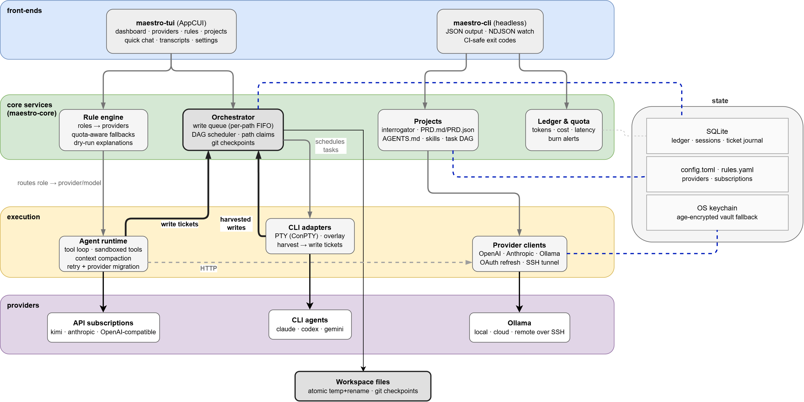

# Maestro

**Management layer for AI CLI tools and LLM API subscriptions**, built on [AppCUI](https://github.com/gdt050579/AppCUI-rs) (Rust) — a cross-platform TUI plus a headless CLI.

Maestro lets a developer who owns **several LLM subscriptions and CLI tools** treat them as one orchestra: register every provider once, assign models to **roles** via quota-aware **rules**, split projects into **parallel agent tasks** that can never corrupt each other's files, and watch tokens, costs and quotas live.

---

## The problems it solves

**1. Subscription sprawl.** You pay for Kimi, Claude, GLM, Ollama cloud… each with different strengths, prices and remaining quotas. Maestro registers them all — API providers, CLI agents, Ollama local/cloud/remote — in one registry with a live capability matrix and health checks.

**2. "Which model should do this?" is a policy, not a habit.** Declarative rules route *roles* (planner, coder, summarizer, tool-runner, image/doc reader-writer, reviewer, interrogator…) to ordered provider fallback chains with conditions on remaining quota, cost, task type, project or time of day:

```yaml
# rules.yaml — coder: kimi while its quota lasts, then cloud, then local
- id: coder
  role: coder
  min_quota_pct: 20
  fallback_chain: ["kimi/kimi-for-coding", "ollama-cloud/kimi-k2.7-code", "ollama-local/qwen2.5-coder:7b"]
```

`maestro rule dry-run --role coder` explains exactly which provider would be picked and why. When a provider rate-limits or runs dry **mid-session**, the runtime retries, then migrates the session to the next fallback without losing context.

**3. Parallel agents stepping on each other.** Maestro's orchestrator is the **only component allowed to write files**. Agents submit *write tickets* (`path, op, content, base_hash`) to a global queue with per-path FIFO ordering, optimistic concurrency (stale base hash → rejected), atomic temp+rename writes, a SQLite journal, and git checkpoints after every task. Wrapped CLI agents (claude, codex, gemini…) run in an overlay directory and their edits are harvested and re-applied through the same queue — the guarantee holds for them too.

**4. Vague projects produce vague code.** Every Maestro project starts with an **interrogation**: the clarifier engine asks targeted corner-case questions (scope edges, data models, error handling, auth, testing, definition-of-done…) in thorough/balanced/minimal modes. Answers feed the automatic **PRD.md/PRD.json**, **AGENTS.md**, **skill suggestions** and a proposed **task DAG** with dependencies and non-overlapping file claims.

**5. Where did the tokens go?** Every LLM call is ledgered (tokens in/out, cost, latency, session) into SQLite. The TUI dashboard shows live sessions, per-provider quota gauges, burn alerts at configurable thresholds (default 80 %/95 %), ticket-queue stats and full transcripts. Everything is also scriptable: `--json` outputs and an NDJSON event stream for CI.

## Architecture



*Source: docs/architecture.drawio — edit in [draw.io](https://app.diagrams.net) and re-export as PNG over docs/architecture.png.*

Cargo workspace crates:

| Crate | Responsibility |
|---|---|
| `maestro-core` | UI-free core: domain types, TOML config, keychain/vault secrets, SQLite ledger, rule engine, project/PRD/AGENTS.md logic |
| `maestro-providers` | Provider registry + OpenAI/Anthropic/Ollama clients, tool-calling pipeline, OAuth refresh, SSH tunnels, quota tracking |
| `maestro-runtime` | Built-in agent loop: sandboxed tools, ticket-only writes, compaction, retry + migration |
| `maestro-orchestrator` | Global write queue, parallel DAG scheduler, git checkpoints, PRD→DAG generation |
| `maestro-cliadapters` | PTY wrapping of external CLI agents (portable-pty/ConPTY), overlay + harvest |
| `maestro-tui` | AppCUI front-end: dashboard, providers, rules, projects, questions, quick chat, transcripts, settings |
| `maestro-gui` | egui/eframe desktop front-end: poller-backed snapshot, worker-thread jobs, dashboard, providers, projects, settings |
| `maestro-cli` | The `maestro` binary: headless commands + TUI and GUI launchers |

Key design guarantees:

- **Single writer** — no agent ever touches the filesystem directly, including wrapped CLI tools (overlay + harvest).
- **Secrets never in config** — OS keychain (Windows Credential Manager / macOS Keychain / Secret Service), age-encrypted vault fallback, `MAESTRO_KEY_*` env passthrough for CI. Force a backend with `MAESTRO_SECRETS_BACKEND=vault|keychain` (headless machines) and unlock the vault with `MAESTRO_VAULT_PASSWORD`.
- **Provider-agnostic history** — sessions migrate between providers on quota/overload events without losing context.

## Download

Prebuilt binaries are attached to every [release](../../releases):

| OS | Architecture | Asset |
|---|---|---|
| Windows | x86_64 | `maestro-<version>-windows-x86_64.zip` |
| Linux | x86_64 | `maestro-<version>-linux-x86_64.tar.gz` |
| Linux | aarch64 | `maestro-<version>-linux-aarch64.tar.gz` |
| macOS | Apple Silicon | `maestro-<version>-macos-aarch64.tar.gz` |
| macOS | Intel | `maestro-<version>-macos-x86_64.tar.gz` |

Each archive holds the `maestro` binary, this README, the licence and the design PDF; `SHA256SUMS` is published alongside (`sha256sum -c SHA256SUMS`). Unpack anywhere on your `PATH` and run `maestro config doctor`.

Releases are cut by pushing a tag — `git tag v0.1.0 && git push origin v0.1.0` — which triggers `.github/workflows/release.yml` to build every target and publish the assets.

On Linux the TUI needs ncurses and X11 clipboard libraries at runtime:
`sudo apt install libncurses6 libxcb1 libxcb-render0 libxcb-shape0 libxcb-xfixes0`

## Quick start

```sh
cargo install --path maestro-cli     # or: cargo run

maestro config doctor                # verify environment
maestro provider detect --register   # find ollama + CLI agents
maestro provider add --id kimi --ptype api --endpoint https://api.kimi.com/coding/v1 --key <key>
maestro rule init                    # seed routing rules from your providers
maestro provider test --id kimi --model k3

maestro                              # launch the TUI
maestro gui                          # launch the desktop window

# headless agent work
maestro run --role coder --task "Create hello.md" --workdir ./scratch
maestro project new --name my-app    # scaffold + clarification interview
maestro project build --name my-app  # PRD.md/PRD.json + AGENTS.md + skills + tasks.yaml
maestro batch --spec tasks.yaml --workdir . --watch   # parallel DAG, NDJSON events
```

Colour themes: **Tools → Theme** switches live and is remembered in `config.toml`; the Settings window (`F10`) offers the same picker.

| Dark themes | Look | Light themes | Look |
|---|---|---|---|
| `default` | AppCUI default | `light` | AppCUI light |
| `dark-gray` | high-contrast grey | `paper` | white paper, dark ink |
| `dark` | white on black | `fancy` | pink background, dark text |
| `hacker` | green phosphor on black | `sky` | pale cyan, navy ink |
| `ocean` | cyan on deep blue | `mint` | pale green, forest ink |
| `amber` | retro amber CRT | `sand` | warm sand, brown ink |
| `rainbow` | a different hue per surface | | |

`python docs/theme_report.py` renders every theme offscreen and reports the background colours it actually paints (used to verify light/dark claims).

## Documentation

- `docs/TUI-DESIGN.md` — UI wireframes, interaction flows, settings inventory (also as PDF in `docs/`)
- CI: `.github/workflows/ci.yml` (fmt, clippy `-D warnings`, tests on Windows/Linux/macOS)

## License

MIT — see [LICENSE](LICENSE).
